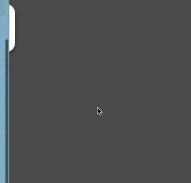
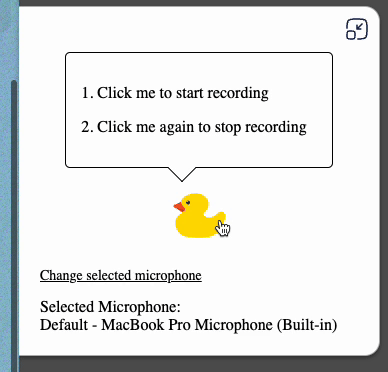
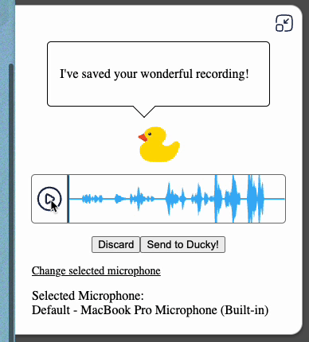
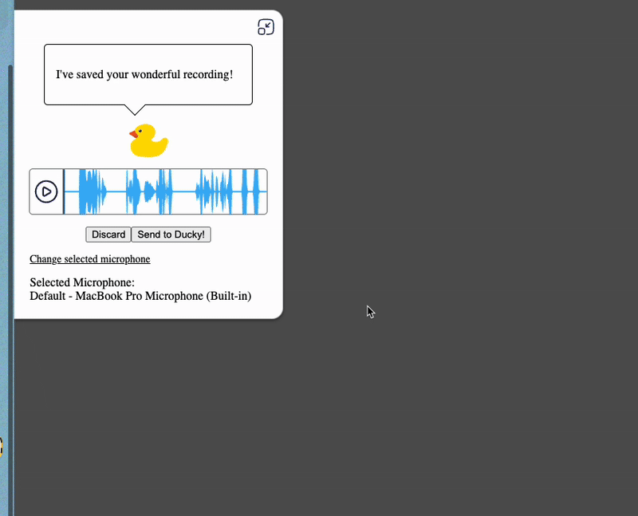

<p align="center">
  <svg
    width="100px"
    height="100px"
    viewBox="0 0 3000 3000"
    xmlns="http://www.w3.org/2000/svg"
  >
    <g>
      <g class="ducky">
        <g>
          <g>
            <path
              fill="#FEDC00"
              d="M2190.118,1434.824c-246.691,282.498-628.62,81.523-520.282-28.548l-0.061-0.051 c110.778-86.449,184.663-203.856,195.711-332.546c22.389-260.646-221.247-468.654-544.162-464.6 c-322.928,4.025-602.819,218.644-625.198,479.308c-10.312,120.123,35.974,229.012,120.378,311.169 c-127.627,55.625-227.648,149.864-270.703,270.553c-87.885,246.434,87.151,599.549,400.484,677.716 c39.459,9.813,79.073,16.261,118.415,19.49c0.269,0.037,0.501,0.063,0.765,0.092 c849.458,72.914,1240.544,15.791,1462.988-744.529C2599.607,1379.551,2362.149,1237.924,2190.118,1434.824z"
            />
            <path
              fill="#F15623"
              d="M718.501,969.736c-50.436,43.531-155.09,75.824-200.987,88.712 c-75.488,21.183-77.629,100.856-11.048,128.831c69.656,29.281,166.412,71.83,239.394,142.406 c56.062,54.185,190.851,37.568,179.27-82.642c-7.35-76.591-99.553-83.716-136.912-194.48 C763.345,978.657,753.117,939.883,718.501,969.736z"
            />
          </g>
          <path
            fill="#333232"
            d="M1127.263,985.329c-3.882,45.233-43.71,78.759-88.946,74.882c-45.231-3.882-78.791-43.708-74.914-88.944 c3.883-45.235,43.737-78.776,88.96-74.867C1097.613,900.275,1131.14,940.088,1127.263,985.329z"
          />
          <path
            fill="#FFFFFF"
            d="M1025.018,950.055c-13.769,9.974-29.399,11.928-34.876,4.332c-5.513-7.595,1.125-21.846,14.907-31.82 c13.695-10.008,29.354-11.943,34.853-4.362C1045.429,925.821,1038.759,940.088,1025.018,950.055z"
          />
        </g>
        <path
          fill="#9F360E"
          d="M560.445,1210.802c14.311,6.599,104.77,38.07,171.178,72.199c67.947,34.862,118.691,39.373,122.354,13.28 C861.281,1244.33,707.134,1254.567,560.445,1210.802z"
        />
        <g>
          <path
            fill="#E9C103"
            d="M636.065,2073.217c-1.53-1.968-3.024-3.734-4.392-4.91 C633.099,2069.955,634.598,2071.604,636.065,2073.217z"
          />
        </g>
      </g>
    </g>
  </svg>
  <h1 align="center">Rubber Ducky AI</h1>
  <p align="center">
    An LLM-powered rubber duck debugging tool for developers
    <br />
    <br />
    <br />
  </p>
</p>

<!-- TABLE OF CONTENTS -->
<details open="open">
  <summary id="table-of-contents">Table of Contents</summary>
  <ol>
    <li>
      <a href="#installation-instructions">Installation Instructions</a>
    </li>
    <li>
      <a href="#workflow-overview">Workflow Overview</a>
    </li>
    <li>
      <a href="#about-the-project">About The Project</a>
    </li>
    <li>
      <a href="#how-to-use">How to use</a>
      <ol>
        <li><a href="#1-open-slider">Open slider</a></li>
        <li><a href="#2-record">Record yourself brainstorming</a></li>
        <li><a href="#3-playback">Playback your recording</a></li>
        <li><a href="#4-submit--response">Submit and LLM-powered ducky will respond</a></li>
      </ol>
    </li>
    <li><a href="#contact">Contact</a></li>
  </ol>
</details>

## About The Project
[Back to top](#table-of-contents)

<p>Built With:</p>
<ul>
  <li>Vue frontend</li>
  <li>Media Recorder API</li>
  <li>Custom microphone audio visualization</li>
  <li>Wavesurfer integration for audio playback and visualization</li>
  <li>Mermaid diagram integration</li>
  <li>Express backend</li>
  <li>OpenAI API Transcription Model integration</li>
  <li>OpenAI API Completion Model integration</li>
</ul>

### Description

Rubber Ducky AI is built as a Chrome Extension to be overlayed onto any website the developer is currently viewing. It slides out on click and allows users to record audio of themselves brainstorming and debugging. Once done, users can playback the audio and send it to ducky. Using the power of LLMs, ducky will respond with a well-laid-out mermaid diagram to assist the developer in their debugging journey. Just like the rubber duck debugging method, except this duck talks back!

## Installation Instructions
[Back to top](#table-of-contents)

1. Clone repo locally
2. From the terminal, go to the root folder and run:

  ```
  npm install
  ```

3. Go to the backend folder, and run:

  ```
  npm install
  ```

4. Login to the [Open AI API website](platform.openai.com) and click Dashboard

5. Go to API keys and create a new secret key (make sure to allow all permissions)

6. Buy credits for token usage attached to your Open AI account

7. Create a file named **".env"** in the root folder

8. Enter the following and save:
```
OPENAI_API_KEY=<Your Open AI API Key Here>
```

9. Once the above is setup, run the frontend with
```
npm run front-serve
```
10. And the backend with:
```
npm run back-serve
```

## Workflow Overview
[Back to top](#table-of-contents)


## How to use

### 1. Open Slider
[Back to top](#table-of-contents)



### 2. Record
[Back to top](#table-of-contents)



### 3. Playback
[Back to top](#table-of-contents)



### 4. Submit & Response
[Back to top](#table-of-contents)



<!-- CONTACT -->
## Contact
[Back to top](#table-of-contents)

Jason Cahela:
 - LinkedIn: https://www.linkedin.com/in/jason-cahela/
 - Email: jpacahela@gmail.com
